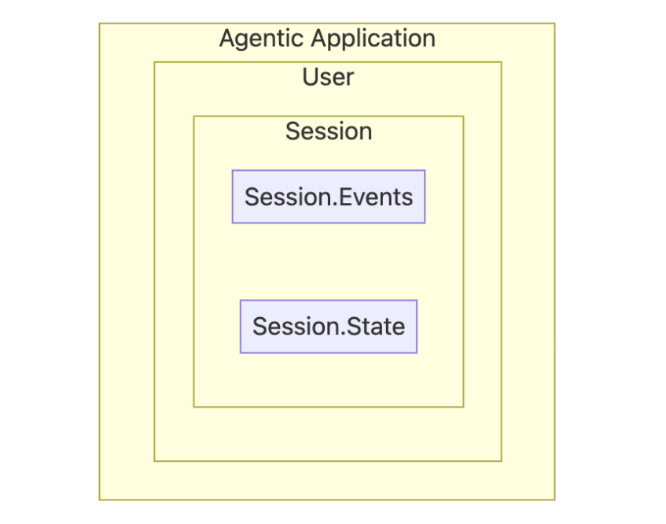

# Agent Sessions

## Table of Contents

1. [Understanding Session Management](#understanding-session-management)
2. [Project Setup](#project-setup)
3. [Implementing Our First Stateful Agent](#implementing-our-first-stateful-agent)
4. [Persistent Sessions with DatabaseSessionService](#persistent-sessions-with-databasesessionservice)
5. [Context Compaction](#context-compaction)
6. [Working with Session State](#working-with-session-state)

---

## Understanding Session Management

**The Problem**


At their core, Large Language Models are **inherently stateless**
. Their awareness is confined to the information you provide in a single API call. This means an agent without proper context management will react to the current prompt without considering any previous history.

**Why does this matter**
? Imagine trying to have a meaningful conversation with someone who forgets everything you've said after each sentence. That's the challenge we face with raw LLMs!

In ADK, we use Sessions for **short term memory management**
 and Memory for **long term memory**
. In the next notebook, you'll focus on Memory.

**What is a Session**

A session is a container for conversations. It encapsulates the conversation history in a chronological manner and also records all tool interactions and responses for a single, continuous conversation. A session is tied to a user and agent; it is not shared with other users. Similarly, a session history for an Agent is not shared with other Agents.

In ADK, a **Session**
 is comprised of two key components `Events` and `State`:

**Session.Events:**


While a session is a container for conversations, `Events` are the building blocks of a conversation.

Example of Events:

- *User Input*: A message from the user (text, audio, image, etc.)
- *Agent Response*: The agent's reply to the user
- *Tool Call*: The agent's decision to use an external tool or API
- *Tool Output*: The data returned from a tool call, which the agent uses to continue its reasoning

**Session.State:**


`session.state` is the Agent's scratchpad, where it stores and updates dynamic details needed during the conversation. Think of it as a global `{key, value}` pair storage which is available to all subagents and tools.

  

**Project Setup**

**Install the SDK**
  ```py
  pip install google-adk
  ```
**Import ADK Components**

  ```py
  from typing import Any, Dict

from google.adk.agents import Agent, LlmAgent
from google.adk.apps.app import App, EventsCompactionConfig
from google.adk.models.google_llm import Gemini
from google.adk.sessions import DatabaseSessionService
from google.adk.sessions import InMemorySessionService
from google.adk.runners import Runner
from google.adk.tools.tool_context import ToolContext
from google.genai import types
```

**Helper functions**

Helper function that manages a complete conversation session, handling session creation/retrieval, query processing, and response streaming. It supports both single queries and multiple queries in sequence.

```py
# Define helper functions that will be reused throughout the notebook
async def run_session(
    runner_instance: Runner,
    user_queries: list[str] | str = None,
    session_name: str = "default",
):
    print(f"\n ### Session: {session_name}")

    # Get app name from the Runner
    app_name = runner_instance.app_name

    # Attempt to create a new session or retrieve an existing one
    try:
        session = await session_service.create_session(
            app_name=app_name, user_id=USER_ID, session_id=session_name
        )
    except:
        session = await session_service.get_session(
            app_name=app_name, user_id=USER_ID, session_id=session_name
        )
    # Process queries if provided
    if user_queries:
        # Convert single query to list for uniform processing
        if type(user_queries) == str:
            user_queries = [user_queries]

        # Process each query in the list sequentially
        for query in user_queries:
            print(f"\nUser > {query}")

            # Convert the query string to the ADK Content format
            query = types.Content(role="user", parts=[types.Part(text=query)])

            # Stream the agent's response asynchronously
            async for event in runner_instance.run_async(
                user_id=USER_ID, session_id=session.id, new_message=query
            ):

            # Check if the event contains valid content
                if event.content and event.content.parts:
                    # Filter out empty or "None" responses before printing
                    if (
                        event.content.parts[0].text != "None"
                        and event.content.parts[0].text
                    ):
                        print(f"{MODEL_NAME} > ", event.content.parts[0].text)
               else:
                 print("No queries!")
```
**Configure Retry Options**

```py
retry_config = types.HttpRetryOptions(
    attempts=5,  # Maximum retry attempts
    exp_base=7,  # Delay multiplier
    initial_delay=1,
    http_status_codes=[429, 500, 503, 504],  # Retry on these HTTP errors
)
```

**Implementing Our First StateFul Agent**

Let's build our first stateful agent, that can remember and have constructive conversations.

```py
APP_NAME = "default"  # Application
USER_ID = "default"  # User
SESSION = "default"  # Session

MODEL_NAME = "gemini-2.5-flash-lite"


# Step 1: Create the LLM Agent
root_agent = Agent(
    model=Gemini(model="gemini-2.5-flash-lite", retry_options=retry_config),
    name="text_chat_bot",
    description="A text chatbot",  # Description of the agent's purpose
)

# Step 2: Set up Session Management
# InMemorySessionService stores conversations in RAM (temporary)
session_service = InMemorySessionService()

# Step 3: Create the Runner
runner = Runner(agent=root_agent, app_name=APP_NAME, session_service=session_service)

```
            
**Testing Our Stateful Agent**

```py
# Run a conversation with two queries in the same session
# Notice: Both queries are part of the SAME session, so context is maintained
await run_session(
    runner,
    [
        "Hi, I am Sam! What is the capital of United States?",
        "Hello! What is my name?",  # This time, the agent should remember!
    ],
    "stateful-agentic-session",
)
```

**Persisitent Sessions with `DatabaseSessionService`**

Session information is not persistent (i.e., meaningful conversations are lost). While this is advantageous in testing environments, **in the real world, a user should be able to refer from past and resume conversations**
. To achieve this, we must persist information.

**Implementing Persistent Sessions**

Let's upgrade to `DatabaseSessionService` using `SQLite`. This gives us persistence without needing a separate database server for this demo.

Let's create a chatbot_agent capable of having a conversation with the user.

```py
# Step 1: Create the same agent (notice we use LlmAgent this time)
chatbot_agent = LlmAgent(
    model=Gemini(model="gemini-2.5-flash-lite", retry_options=retry_config),
    name="text_chat_bot",
    description="A text chatbot with persistent memory",
)

# Step 2: Switch to DatabaseSessionService
# SQLite database will be created automatically
db_url = "sqlite:///my_agent_data.db"  # Local SQLite file
session_service = DatabaseSessionService(db_url=db_url)

# Step 3: Create a new runner with persistent storage
runner = Runner(agent=chatbot_agent, app_name=APP_NAME, session_service=session_service)
```

**Verify Persistence**

You can inspeact `the my_agent_data.db` SQlite database to see how the conversations events are stored.

```py
await run_session(
    runner,
    ["Hi, I am Sam! What is the capital of the United States?", "Hello! What is my name?"],
    "test-db-session-01",
)
```

**Context Compaction**

As you can see, all the events are stored in full in the session Database, and this quickly adds up. For a long, complex task, this list of events can become very large, leading to slower performance and higher costs.

But what if we could automatically summarize the past? Let's use ADK's **Context Compaction**
 feature to see **how to automatically reduce the context that's stored in the Session**
.

**Create an App for the agent**

The first step is to create an object called `App`. We'll give it a name and pass in our `chatbot_agent`.

We'll also create a new config to do the Context Compaction. This **EventsCompactionConfig**
 defines two key variables:

**compaction_interval**
: Asks the Runner to compact the history after every n conversations

**overlap_size**
: Defines the number of previous conversations to retain for overlap

```py
# Re-define our app with Events Compaction enabled
research_app_compacting = App(
    name="research_app_compacting",
    root_agent=chatbot_agent,
    # This is the new part!
    events_compaction_config=EventsCompactionConfig(
        compaction_interval=3,  # Trigger compaction every 3 invocations
        overlap_size=1,  # Keep 1 previous turn for context
    ),
)

db_url = "sqlite:///my_agent_data.db"  # Local SQLite file
session_service = DatabaseSessionService(db_url=db_url)

# Create a new runner for our upgraded app
research_runner_compacting = Runner(
    app=research_app_compacting, session_service=session_service
)
```

**Run the app**

we configured our App, a compaction process will run silently in the background after the 3rd invocation.
        
```py
# Turn 1
await run_session(
    research_runner_compacting,
    "What is the latest news about AI in healthcare?",
    "compaction_demo",
)

# Turn 2
await run_session(
    research_runner_compacting,
    "Are there any new developments in drug discovery?",
    "compaction_demo",
)

# Turn 3 - Compaction should trigger after this turn!
await run_session(
    research_runner_compacting,
    "Tell me more about the second development you found.",
    "compaction_demo",
)

# Turn 4
await run_session(
    research_runner_compacting,
    "Who are the main companies involved in that?",
    "compaction_demo",
)
```

**Working with Session State**

**The Problem**


While we can do Context Compaction and use a database to resume a session, we face new challenges now. In some cases, **we have key information or preferences that we want to share across other sessions**
.

In these scenarios, instead of sharing the entire session history, transferring information from a few key variables can improve the session experience. Let's see how to do it!

**Creating Custom tools for Session State**

Let's explore how to manually manage session state through custom tools. In this example, we'll identify a **transferable characteristic**
, like a user's name and their country, and create tools to capture and save it.


Here, for demo purposes, we'll create two tools that can store and retrieve user name and country from the Session State. **Note that all tools have access to the ToolContext object**
. You don't have to create separate tools for each piece of information you want to share.

```py
# Define scope levels for state keys (following best practices)
USER_NAME_SCOPE_LEVELS = ("temp", "user", "app")


# This demonstrates how tools can write to session state using tool_context.
# The 'user:' prefix indicates this is user-specific data.
def save_userinfo(
    tool_context: ToolContext, user_name: str, country: str
) -> Dict[str, Any]:
    """
    Tool to record and save user name and country in session state.

    Args:
        user_name: The username to store in session state
        country: The name of the user's country
    """

# Write to session state using the 'user:' prefix for user data
    tool_context.state["user:name"] = user_name
    tool_context.state["user:country"] = country

    return {"status": "success"}


# This demonstrates how tools can read from session state.
def retrieve_userinfo(tool_context: ToolContext) -> Dict[str, Any]:
    """
    Tool to retrieve user name and country from session state.
    """
    # Read from session state
    user_name = tool_context.state.get("user:name", "Username not found")
    country = tool_context.state.get("user:country", "Country not found")

    return {"status": "success", "user_name": user_name, "country": country}
```

**Creating an agent with Session State Tools**

Now let's create a new agent that has access to our session state management tools:

```py
# Configuration
APP_NAME = "default"
USER_ID = "default"
MODEL_NAME = "gemini-2.5-flash-lite"

# Create an agent with session state tools
root_agent = LlmAgent(
    model=Gemini(model="gemini-2.5-flash-lite", retry_options=retry_config),
    name="text_chat_bot",
    description="""A text chatbot.
    Tools for managing user context:
    * To record username and country when provided use `save_userinfo` tool. 
    * To fetch username and country when required use `retrieve_userinfo` tool.
    """,
    tools=[save_userinfo, retrieve_userinfo],  # Provide the tools to the agent
)

# Set up session service and runner
session_service = InMemorySessionService()
runner = Runner(agent=root_agent, session_service=session_service, app_name="default")
```

**Testing Session State in Action**

Let's test how the agent uses session state to remember information across conversation turns:

```py
# Test conversation demonstrating session state
await run_session(
    runner,
    [
        "Hi there, how are you doing today? What is my name?",  # Agent shouldn't know the name yet
        "My name is Sam. I'm from Poland.",  # Provide name - agent should save it
        "What is my name? Which country am I from?",  # Agent should recall from session state
    ],
    "state-demo-session",
)
```

**Session State Isolation**

As we've already seen, an important characteristic of session state is that it's isolated per session. Let's demonstrate this by starting a new session:

```py
# Start a completely new session - the agent won't know our name
await run_session(
    runner,
    ["Hi there, how are you doing today? What is my name?"],
    "new-isolated-session",
)

# Expected: The agent won't know the name because this is a different session
```

**Cross-Session State Sharing**

While sessions are isolated by default, you might notice something interesting. Let's check the state of our new session (new-isolated-session):

```py
# Check the state of the new session
session = await session_service.get_session(
    app_name=APP_NAME, user_id=USER_ID, session_id="new-isolated-session"
)

print("New Session State:")
print(session.state)

# Note: Depending on implementation, you might see shared state here.
# This is where the distinction between session-specific and user-specific state becomes important.
```