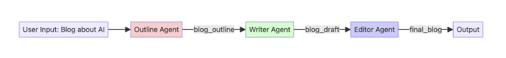
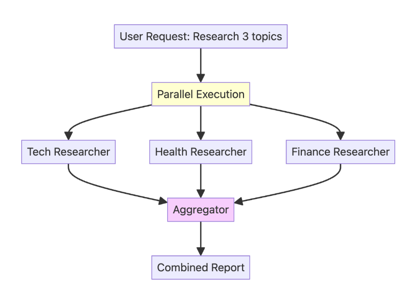

# Workflow Patterns

## Table of Contents

1. [Sequential Workflows - The Assembly Line](#sequential-workflows---the-assembly-line)
2. [Project Setup](#project-setup)
3. [Example: Blog Post Creation with Sequential Agents](#example-blog-post-creation-with-sequential-agents)
4. [Parallel Workflows - Independent Researchers](#parallel-workflows---independent-researchers)
5. [Example: Parallel Multi-Topic Research](#example-parallel-multi-topic-research)
6. [Loop Workflows - The Refinement Cycle](#loop-workflows---the-refinement-cycle)
7. [Example: Iterative Story Refinement](#example-iterative-story-refinement)

---

## Sequential Workflows - The Assembly Line

**The Problem: Unpredictable Order**

The previous multi-agent system worked, but it relied on a **detailed instruction prompt**
 to force the LLM to run steps in order. This can be unreliable. A complex LLM might decide to skip a step, run them in the wrong order, or get `stuck` making the process unpredictable.

**The Solution: A Fixed Pipeline**

When you need tasks to happen in a **guaranteed, specific order,**
 you can use a `Sequential Agent`. This agent acts like an assembly line, `running each sub-agent in the exact order you list them`. `The output of one agent automatically becomes the input for the next`, creating a predictable and reliable workflow.

**Use Sequential when:**
 Order matters, you need a linear pipeline, or each step builds on the previous one.

**Project Seup**

**Install the ADK**
```py
pip install google-adk
```

**Import the ADk components**
```py
from google.adk.agents import Agent, SequentialAgent, ParallelAgent, LoopAgent
from google.adk.models.google_llm import Gemini
from google.adk.runners import InMemoryRunner
from google.adk.tools import AgentTool, FuntionTool, google_search
from google.genai import types
```

**Configure Retry Options**
```py
retry_config = types.HttpRetryOptions(
    attempts = 5,
    exp_base = 7,
    initial_delay = 1,
    http_status_codes = [429, 500, 503, 504],
)
```

**Example: Blog Post Creation with Sequential Agents**
  
Let's build a system with three specialized agents:

**1. Outline Agent -**
 Creates a blog outline for a given topic.

```py
outline_agent = Agent(
    name = "Outline Agent",
    model = Gemini(
        model = "gemini-2.5-flash-lite",
        retry_options = retry_config
    ),
    instruction = """Create a blog outline for the given topic with:
    1. A catchy headline
    2. An introduction hook
    3. 3-5 main sections with 2-3 bullet points for each
    4. A concluding thought""",
    output_key = "blog_outline",
)
```

**2. Writer Agent -**
 Writes a blog post.

```py
writer_agent = Agent(
    name = "WriterAgent",
    model = Gemini(
        model = "gemini-2.5-flash-lite",
        retry_options = retry_config
    ),
    instruction = """Following this outline strictly: {blog_outline}
    Write a brief, 200 to 300-word blog post with an engaging and informative tone.""",
    output_key = "blog_draft",
)
```

**3. Editor Agent -**
 Edits a blog post draft for clarity and structure.
```py
editor_agent = Agent(
    name = "EditorAgent",
    model = Gemini(
        model = "gemini-2.5-flash-lite",
        retry_options = retry_config
    ),
    instruction = """Edit this draft: {blog_draft}
    Your task is to polish the text by fixing any grammatical errors, improving the flow and sentence structure, and enhancing overall clarity.""",
    output_key = "final_blog"
)
```
**Creating Root Agent**

Then we bring the agents together under a sequential agent, which runs the agents in the order that they are listed.

```py
root_agent = SequentialAgent(
    name = "BlogPipeline",
    sub_agents = [outline_agent, writer_agent, editor_agent]
)
```
**Run the Agent**
```py
runner = InMemoryRunner(agent = root_agent)

response = await runner.run_debug(
    "Write a blog post about the benefits of multi-agent systems for software developers"
)
```

**Parallel Workflows - Independent Researchers**

**The Problem: The Bottleneck**

The previous sequential agent is great, but it's an assembly line. Each step must wait for the previous one to finish. What if you have several tasks that are `not dependent` on each other? For example, researching three different topics. Running them in sequence would be slow and inefficient, creating a bottleneck where each task waits unnecessarily.

**The Solution: Concurrent Execution**

When you have independent tasks, you can run them all at the same time using a `ParallelAgent`. This agent executes all of its sub-agents concurrently, dramatically speeding up the workflow. Once all parallel tasks are complete, you can then pass their combined results to a final `aggregator` step.

**Use Parallel when:**
  Tasks are independent, speed matters, and you can execute concurrently.

**Example: Parallel Multi-Topic Research**
  
Let's build a system with four agents:

**1. Tech Researcher -**
 Researcher AI/ML news and trends.
```py
tech_researcher = Agent(
    name = "TechResearcher",
    model = Gemini(
        model = "gemini-2.5-flash-lite",
        retry_options = retry_config
    ),
    instruction = """Research the latest AI/ML trends. Include 3 key developments,
the main companies involved, and the potential impact. Keep the report very concise (100 words).""",
   tools = [google_search],
   output_key = "tech_research",
)
```

**2. Health Researcher -**
 Researcher recent medical news and trends.
```py
health_researcher = Agent(
    name="HealthResearcher",
    model=Gemini(
        model="gemini-2.5-flash-lite",
        retry_options=retry_config
    ),
    instruction="""Research recent medical breakthroughs. Include 3 significant advances,
their practical applications, and estimated timelines. Keep the report concise (100 words).""",
    tools=[google_search],
    output_key="health_research",  # The result will be stored with this key.
)
```

**3. Finance Researcher -**
 Researcher finance and fintech news and trends.

```py
finance_researcher = Agent(
    name="FinanceResearcher",
    model=Gemini(
        model="gemini-2.5-flash-lite",
        retry_options=retry_config
    ),
    instruction="""Research current fintech trends. Include 3 key trends,
their market implications, and the future outlook. Keep the report concise (100 words).""",
    tools=[google_search],
    output_key="finance_research",  # The result will be stored with this key.
)
```

**Aggregator Agent -**
 Combines all research findings into a single summary.
```py
aggregator_agent = Agent(
    name="AggregatorAgent",
    model=Gemini(
        model="gemini-2.5-flash-lite",
        retry_options=retry_config
    ),
    # It uses placeholders to inject the outputs from the parallel agents, which are now in the session state.
    instruction="""Combine these three research findings into a single executive summary:

    **Technology Trends:**

    {tech_research}
    
    **Health Breakthroughs:**

    {health_research}
    
    **Finance Innovations:**

    {finance_research}
    
    Your summary should highlight common themes, surprising connections, and the most important key takeaways from all three reports. The final summary should be around 200 words.""",
    output_key="executive_summary",  # This will be the final output of the entire system.
)
```

**Creating the Parallel Agent**

Then we bring the agents together under a parallel agent, which is itself nested inside of a sequential agent.

```py
parallel_research_team = ParallelAgent(
    name="ParallelResearchTeam",
    sub_agents=[tech_researcher, health_researcher, finance_researcher],
)
```
**Creating the Root Agent**

This SequentialAgent defines the high-level workflow: run the parallel team first, then run the aggregator
```py
root_agent = SequentialAgent(
    name="ResearchSystem",
    sub_agents=[parallel_research_team, aggregator_agent],
)
```

**Running the Agent**

```py
runner = InMemoryRunner(agent=root_agent)
response = await runner.run_debug(
    "Run the daily executive briefing on Tech, Health, and Finance"
)
```

**Loop Workflows - The Refinement Cycle**

**The Problem: One-Shot Quality**

All the workflows we've seen so far run from start to finish. The `SequentialAgent` and `ParallelAgent` produce their final output and then stop. 
This 'one-shot' approach isn't good for tasks that require refinement and quality control. 
What if the first draft of our story is bad? We have no way to review it and ask for a rewrite.

**The Solution: Iterative Refinement**

When a task needs to be improved through cycles of feedback and revision, you can use a `LoopAgent`. 
A LoopAgent runs a set of sub-agents repeatedly until a specific condition is met or a maximum number of iterations is reached. 
This creates a refinement cycle, allowing the agent system to improve its own work over and over.

**Use Loop when**
: Iterative improvement is needed, quality refinement matters, or you need repeated cycles.

**Example: Iterative Story Refinement**
  
Let's build a system with two agents:

**1. Writer Agent -**
 Writes a draft of a short story.
```py
initial_writer_agent = Agent(
    name="InitialWriterAgent",
    model=Gemini(
        model="gemini-2.5-flash-lite",
        retry_options=retry_config
    ),
    instruction="""Based on the user's prompt, write the first draft of a short story (around 100-150 words).
    Output only the story text, with no introduction or explanation.""",
    output_key="current_story",  # Stores the first draft in the state.
)
```

**2. Critic Agent -**
 Reviews and critiques the short story to suggest improvements.
```py
critic_agent = Agent(
    name="CriticAgent",
    model=Gemini(
        model="gemini-2.5-flash-lite",
        retry_options=retry_config
    ),
    instruction="""You are a constructive story critic. Review the story provided below.
    Story: {current_story}
    
    Evaluate the story's plot, characters, and pacing.
    - If the story is well-written and complete, you MUST respond with the exact phrase: "APPROVED"
    - Otherwise, provide 2-3 specific, actionable suggestions for improvement.""",
    output_key="critique",  # Stores the feedback in the state.
)
```
**Creating the Refiner Agent**

We need a way for the loop to actually stop based on the critic's feedback. The `LoopAgent` itself doesn't automatically know that `APPROVED` means `stop`.

we need an agent to give it an explicit signal to terminate the loop.

we do this in two parts: 

1. A simple python function that the `LoopAgent` understands as an `exit` signal.

```py
def exit_loop():
    """Call this function ONLY when the critique is 'APPROVED', 
    indicating the story is finished and no more changes are needed."""

    return {"status": "approved", "message": "Story approved. Exiting refinement loop."}

```
2. An agent that can call that function when the right condition is met.
```py
refiner_agent = Agent(
    name="RefinerAgent",
    model=Gemini(
        model="gemini-2.5-flash-lite",
        retry_options=retry_config
    ),
    instruction="""You are a story refiner. You have a story draft and critique.
    
    Story Draft: {current_story}
    Critique: {critique}
    
    Your task is to analyze the critique.
    - IF the critique is EXACTLY "APPROVED", you MUST call the `exit_loop` function and nothing else.
    - OTHERWISE, rewrite the story draft to fully incorporate the feedback from the critique.""",
    output_key="current_story",  # It overwrites the story with the new, refined version.
    tools = [
        FunctionTool(exit_loop)
    ],  # The tool is now correctly initialized with the function reference.
)
```
**Creating the Loop Agent**

Then we bring the agents together under a loop agent, which is itself nested inside of a sequential agent.

The LoopAgent contains the agents that will run repeatedly: Critic -> Refiner.

```py
story_refinement_loop = LoopAgent(
    name="StoryRefinementLoop",
    sub_agents=[critic_agent, refiner_agent],
    max_iterations=2,  # Prevents infinite loops
)
```

**Creating the Root Agent**

The root agent is a SequentialAgent that defines the overall workflow: Initial Write -> Refinement Loop.

```py
root_agent = SequentialAgent(
    name="StoryPipeline",
    sub_agents=[initial_writer_agent, story_refinement_loop],
)
```

**Run the Agent**

```py
runner = InMemoryRunner(agent=root_agent)
response = await runner.run_debug(
    "Write a short story about a lighthouse keeper who discovers a mysterious, glowing map"
)
```


